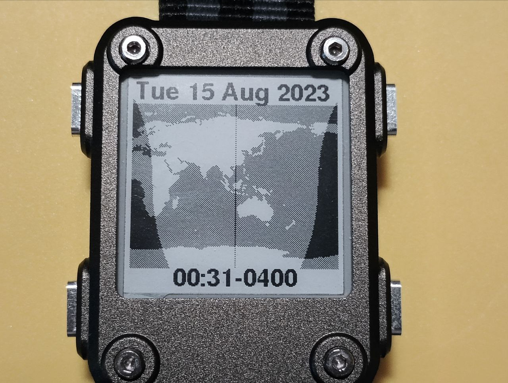

# watchy_solar_noon

Tested with Watchy 1.4.10

Earth image based off

https://neo.gsfc.nasa.gov/view.php?datasetId=SRTM_RAMP2_TOPO
https://neo.gsfc.nasa.gov/servlet/RenderData?si=196466&cs=rgb&format=PNG&width=3600&height=1800

Equirectangular, I think. Slightly modified to make sure some of the islands didn't dissappear and reappear as it slides across your screen.

No guarentee that any of my math is right. I did what I could with rectangles and ellipses.
